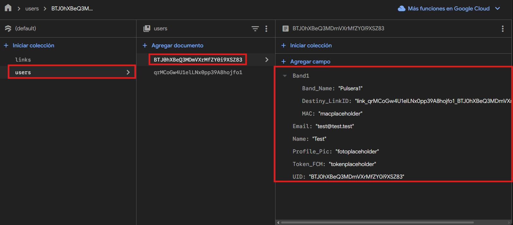
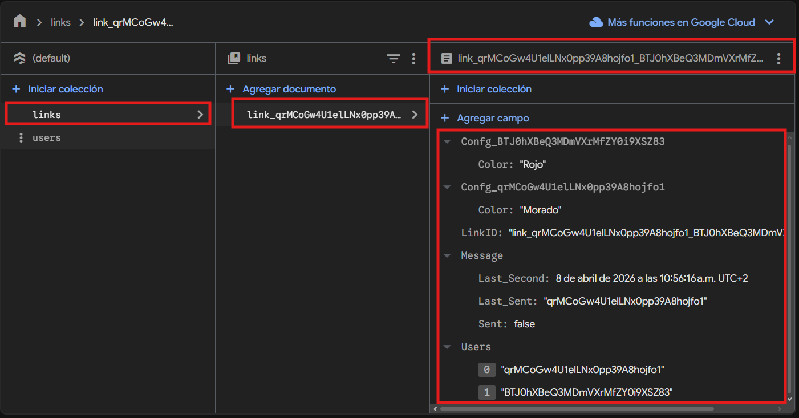

# BBDD
- [BBDD](#bbdd)
  - [¿Qué usamos y porqué?](#qué-usamos-y-porqué)
  - [Dilemas y decisiones iniciales](#dilemas-y-decisiones-iniciales)
    - [Users](#users)
      - [**Nombre del archivo**](#nombre-del-archivo)
      - [**UID**](#uid)
      - [**Token\_FCM**](#token_fcm)
      - [**Profile\_Pic**](#profile_pic)
      - [**Name**](#name)
      - [**Email**](#email)
      - [**BandX**](#bandx)
        - [**Band\_Name**](#band_name)
        - [**Destiny\_Link**](#destiny_link)
        - [**MAC**](#mac)
    - [Links](#links)
      - [**Nombre de archivo**](#nombre-de-archivo)
      - [**Users**](#users-1)
      - [**Message**](#message)
        - [**Last\_Sent** y **Last\_Second**](#last_sent-y-last_second)
        - [**Sent**](#sent)
      - [**ConfgN**](#confgn)

## ¿Qué usamos y porqué?
Tras analizar las opciones y pensar en crear una api para llevar el servidor, acabamos decidiendo que lo mejor era usar **firebase** como base de datos, ya que gracias a su alta compatibilidad con **dart** (el lenguaje que usaremos para la app), podremos crear toda la lógica con **solo la base de datos y los procesos de la app**.

## Dilemas y decisiones iniciales
Al empezar un proyecto de este estilo hay que tomar decisiones con la base de datos, tanto si será **SQL** o **NoSQL**, como la **estructura de los documentos** y los distintos campos que podamos necesitar. La conclusión a la que llegamos fue a la de hacer una base **NoSQL**, ya que hay datos que no siempre se van a compartir y va a ser mucho más escalable. Uno de estos campos por ejemplo, será el de **"band"** refiriendose a cada pulsera que tenga el usuario, que puede ir desde 0 hasta una cantidad infinita (siempre y cuando las tenga de manera física, obviamente), así que **no tendría sentido** crear infinita cantidad de posibles pulseras, ni restringir a usuarios a tener un número limitado de ellas, **suponiendo esto un problema de libertad al usuario o de espacio en la base de datos**. Una vez decidido esto (y debido a la inexperiencia en este tipo de entornos) tuvimos que pensar en la lógica de los **ficheros** y las **colecciones**, llegando a la conclusión de usar **dos colecciones principales:**
### Users
Esta colección estará completamente dedicada a los **datos de usuario**, tales como el **nombre** o la **foto de perfil**, así que vamos a ver la **estructura** y comentar cada **campo**:

#### **Nombre del archivo**
El nombre del archivo será autogenerado por la base de datos.
#### **UID**
El ID del usuario, este será el mismo que el nombre del archivo, pues así facilitará tanto las consultas como la busqueda de archivos al ser el mismo.
#### **Token_FCM**
Un token generado por firebase para poder enviar notificaciones push a los usuarios, también sirve como identificador único para los usuarios, pero esto está gestionado exclusivamente por firebase.
#### **Profile_Pic**
Será la dirección en donde se aloja la foto de perfil del usuario, esto se actualizará cuando lo haga el usuario ya que no es algo crucial para el funcionamiento.
#### **Name**
Simplemente el nombre del usuario.
#### **Email**
El email del usuario para poder mandar notificaciones via email, pues los datos de usuario se almacenan en otra parte de firebase.
#### **BandX**
Aquí es donde viene parte de la importancia de que la BBDD sea **NoSQL**, pues este campo será creado proceduralmente según vaya añadiendo más pulseras. Este campo es de tipo **map**, que es lo que nos permitirá crear conjuntos de campos, para no tener que crear **MAC1**, **MAC2**, **MAC3**..., sino que será directamente **Band1.MAC**, permitiendo una estandarización y organización mejor por pulsera.
##### **Band_Name**
Esto definirá el nombre que le dará el usuario a la pulsera a la hora de vincularla, para luego poder reconocerla al usar la app.
##### **Destiny_Link**
Esto estará mejor explicado en [este documento](./Funcionalidad.md), pero básicamente delimitará el enlace por defecto al que se enviará el mensaje al pulsar el botón de la pulsera.
##### **MAC**
Simplemente pondrá la dirección MAC de la pulsera, para poder saber que pulsera es en los distintos procesos y demás, este campo se rellenará al vincular la pulsera con la app.
### Links
Esta base de datos es **la que le dará la utilidad que necesitamos**, pues es la que **unirá a los usuarios** y nos permitirá **hacer las consultas para los mensajes**. De momento solo unirá a **dos** usuarios, pero (en futuro próximo), intentaremos poder crear **grupos**, que se basrán en archivos de esta colección para poder mandar mensajes en **"broadcast"** dentro de ellos. Estos archivos se **crearán** al **añadir a alguien como amigo**, y seguirán la siguiente estructura:

#### **Nombre de archivo**
El nombre del archivo será una concatenación de **"link"**, seguido por los **UID** de los **usuarios pertenecientes al enlace** separados de barras bajas.
#### **Users**
Este campo será un **array** con los **UID** de los usuarios del enlace, para que puedan escuchar únicamente los archivos en los que están incluidos en este campo.
#### **Message**
El núcleo del funcionamiento del mensaje, este **map** será el que analizará la app para poder saber cuando debe recibir una notificación.
##### **Last_Sent** y **Last_Second**
Estos campos contendrán **siempre** (a no ser que haya un fallo en la conexión) la **UID** del último usuario de la pareja en pulsar su botón (además de la última hora en la que lo hizo con un campo de tipo **timestamp**) para que la app pueda analizar quién de los dos hizo la petición de mensaje y que pueda enviar dos mensajes seguidos (con un segundo de diferencia).
##### **Sent**
Este campo será el que mande la señal de inicio a la app para mandar el mensaje, pues es un **booleano** que cambiará únicamente entre **"true"** y **"false"**, haciendo que cuando este campo sea **"true"** la app analice los dos campos anteriores y actúe en base a eso.
#### **ConfgN**
Creado en base a los **UID**, este campo servirá para las configuraciones de usuario que puede tener en específico cada enlace, como el color con el que quieres recibir tu notificación en este caso.

